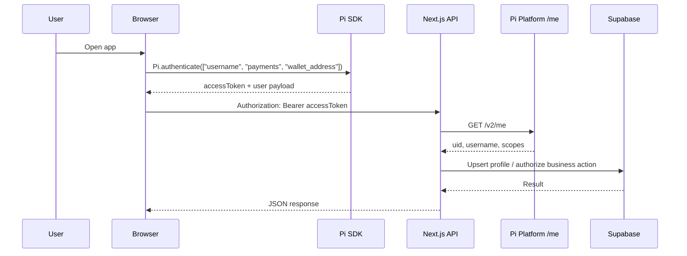
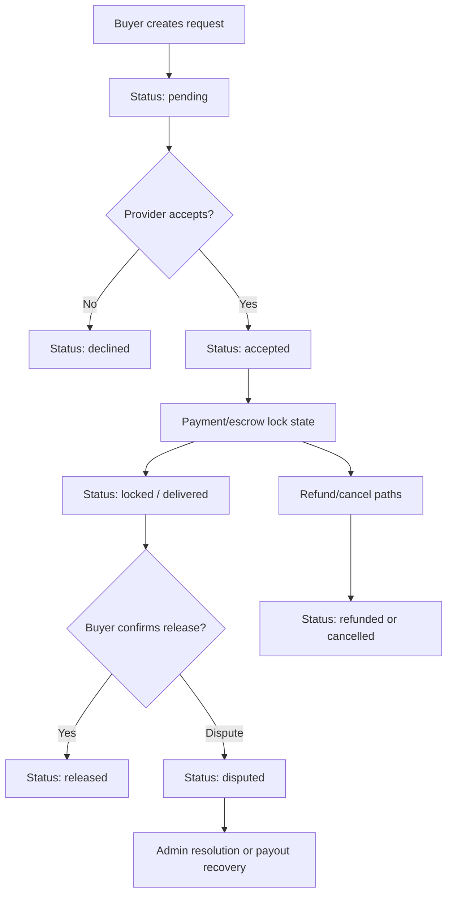

# Talse

Talse is a Pi-powered marketplace and service coordination application built with Next.js, Supabase, and the Pi SDK. It allows users to create and browse services, submit and manage hire requests, exchange messages, manage escrow-related payment states, leave reviews, and handle dispute and payout recovery workflows through server-side backend routes.

The repository is a working application implementation rather than a generic starter template. The codebase focuses on a real marketplace workflow with a clear server-side trust boundary around Pi authentication, Supabase data writes, and payment operations.

## Product overview

Talse is designed around a simple marketplace model:

- service providers publish listings
- buyers request work through a hire-request lifecycle
- providers can accept, decline, or process work
- the app tracks delivery, disputes, and payment state
- admin users can review disputes and operational metrics
- Pi authentication provides the user identity layer for marketplace actions

The implementation combines a Next.js front end with a backend written as App Router API routes in the same application. This is important because the app treats the browser as untrusted and verifies the Pi access token on the server before allowing privileged writes to Supabase or platform payment endpoints.

## Core capabilities

The application currently implements the following functional areas:

- marketplace catalog and service listing management
- user profile persistence and profile updates
- service creation, update, activation, and deletion
- hire-request submission, acceptance, cancellation, dispute filing, and status transitions
- message threads linked to each hire request
- reviews tied to completed/released hire requests
- admin dashboard and review surfaces for operational oversight
- incomplete payment recovery and payout safety checks
- Pi Platform and Pi Testnet-related payment flow control
- platform fee and payout tracking metadata in the database

## Architecture overview

The repository is organized as a Next.js App Router application with client-side UI in `components/`, server-side API routes under `app/api/`, and shared logic in `lib/` and `contexts/`.

```mermaid
flowchart LR
  U[User] --> B[Browser UI]
  B --> P[Pi SDK / authenticate()]
  P --> T[Pi Platform access token]
  B --> A[Next.js App Router API]
  A --> V[verifyPiToken() /me validation]
  A --> S[(Supabase Postgres)]
  A --> PI[Pi Platform API]
  A --> H[Pi Testnet / Horizon]
  A --> ADM[Admin workflows]
```

At a high level:

- the browser authenticates with Pi and receives an access token
- the server verifies that token against the Pi Platform `/me` endpoint before trusting the caller
- the app writes trusted user identity and marketplace state to Supabase
- Pi payment operations, such as approval and completion, are handled through the server-side Platform API
- blockchain-oriented payment or A2U flows remain separated from the browser and Platform API access path

## Technology stack

| Layer | Implementation |
| --- | --- |
| Application framework | Next.js 15 with App Router |
| Language | TypeScript |
| UI | React 19, Tailwind CSS, Radix UI primitives |
| Auth | Pi SDK + server-side token verification |
| Data | Supabase Postgres |
| Payment/signing | Pi Platform API + Stellar SDK / Horizon-compatible flow |
| Storage | Supabase storage buckets, signed URLs when relevant |
| Local tooling | Playwright, TypeScript, ESLint |

The app uses a hybrid architecture: browser UI handles presentation and user-triggered flows, while write operations tied to identity, marketplace state, and payments are routed through server-side API endpoints.

## Application architecture and data flow

The project is organized around a few clear layers:

1. `app/` contains route handlers and page entry points.
2. `components/` contains screen-level UI and interactive panels.
3. `contexts/` contains the Pi auth context and service state context.
4. `lib/` contains domain logic, API helpers, fee logic, Pi utilities, and Supabase access.
5. `supabase/` contains SQL schema and migration-style setup definitions.

The service layer is a backend-first design. The UI obtains access to data through `useServices()` and `backendApi`, which call the same Next.js API routes used by the application backend. This reduces client-side trust assumptions and keeps the relevant API contract centralized.

## Pi Network integration

The project includes explicit separation between the following concerns:

- Pi Platform API: used for user verification and server-side payment operations
- Pi Testnet / blockchain APIs: used for blockchain-side / Horizon operations and A2U signing flows
- browser Pi SDK: used to authenticate and obtain a user access token
- server API: used to verify and authorize the user before business actions

This distinction is not incidental. The implementation explicitly documents and enforces the correct Platform host for token verification and Platform operations. The project uses:

- `PI_PLATFORM_API_BASE` defaulting to `https://api.minepi.com/v2`
- `PI_TESTNET_BLOCKCHAIN_API_BASE` defaulting to `https://api.testnet.minepi.com`

This separation matters because the Pi user access token is verified against the Platform API `/me` endpoint, not the Testnet blockchain host. The repository contains code that intentionally prevents the earlier mistake of using the blockchain Testnet host as the user-authentication endpoint.

## Authentication architecture

Authentication is built around the Pi SDK browser flow:



Relevant implementation details:

- `contexts/pi-auth-context.tsx` loads the Pi SDK and calls `window.Pi.init({ version: "2.0", sandbox: ... })`
- the browser then calls `window.Pi.authenticate([...], onIncompletePaymentFound)`
- the returned access token is stored in app state and passed to API calls as `Authorization: Bearer ...`
- server routes validate the token using `verifyPiToken()` before they trust any UI-supplied identity
- `lib/pi-verify.ts` calls `${PI_PLATFORM_API_BASE}/me` to verify the token using the Platform API as the source of truth

This is the key security boundary: the client may be considered untrusted by design, and the backend does not accept user identity claims from the browser without verification.

## Marketplace workflow

The marketplace is based on a shared services catalog stored in Supabase.

- `services` rows represent items for sale or work offered by a provider
- each listing includes title, category, description, price, delivery estimate, images, and active state
- service ownership is tied to a Pi user identity stored in `profiles`
- service routes under `app/api/services` support listing, create, update, delete, and activation flows
- the UI uses `useServices()` and `backendApi.services` to load the catalog and keep the frontend aligned with backend state

The code is intentionally designed so the marketplace catalogue is not just a browser-only local state; it is backed by structured backend records and server-side ownership checks.

## Hire-request lifecycle

Hire requests are stored in `hire_requests` and follow a status lifecycle aligned with the repository’s types and SQL schema.

Implemented lifecycle values include:

- `pending`
- `accepted`
- `declined`
- `locked`
- `delivered`
- `released`
- `disputed`
- `refunded`
- `cancelled`

The flow implemented by the app is roughly:

1. buyer submits a request for a service
2. provider receives it in the incoming request list
3. provider accepts or declines
4. accepted requests can move into lock / delivery / release or dispute states
5. buyer and provider can exchange messages tied to the hire request
6. reviews are submitted on released work

The server-side hire-request routes live under `app/api/hire-requests` and enforce identity checks before any mutation. This logic is central to the app: the service owner, buyer, and admin roles are all validated using the Pi-authenticated identity.



## Escrow/payment architecture

The repo contains a payment flow that is designed around escrow and payout safety rather than only a simple client-side fee banner.

The implementation includes:

- `lib/pi-platform.ts` for server-side Pi payment API calls such as approval, completion, lookup, cancellation, and `incomplete_server_payments`
- `lib/dispute-resolution.ts` for payout execution and recovery logic
- `supabase/schema.sql` adds payout-related columns including `platform_fee`, `worker_payout`, `payout_locked_at`, and `payout_status`
- `app/api/payments/approve`, `complete`, `recover`, and `incomplete` routes

Important nuance:

- the app distinguishes the Pi Platform API from Pi blockchain/Testnet usage
- platform actions are issued with the server API key (`PI_API_KEY`)
- blockchain / A2U operations remain separate and handled in dedicated helpers, including the application wallet signing flow

The payout logic intentionally acquires a payout lock before a release or refund operation. This is a defensive concurrency measure to reduce duplicate payout execution. The code comments and exception classes explicitly surface the operational intent: avoid duplicate payouts, block stale or unreconciled operations, and preserve data integrity when a wallet lease or payment state becomes inconsistent.

## Payment safety and recovery mechanisms

The repository includes a real recovery-oriented safety layer for incomplete or stuck payments.

The implementation includes:

- `getIncompleteServerPayments()` from the Pi Platform API
- reconciliation logic that looks for payment metadata keyed to a `hireRequestId`
- stale payment cancellation and retry logic
- payout lease and lock management to prevent concurrent release/refund races
- specific error classes such as:
  - `PayoutNotConfiguredError`
  - `PayoutBlockedByUnreconciledPaymentError`
  - `PayoutWalletBusyError`
  - `PayoutWalletLeaseLostError`

This is an operational safety mechanism that is important for real-world transaction recovery. It is not a claim that all edge cases are solved; rather, the repository documents and implements the recovery logic needed to handle stuck or incomplete payment records with explicit failure paths.

## Dispute-resolution system

The dispute system is implemented in the backend and admin surfaces.

- disputes are represented as `hire_requests` with `status = 'disputed'` and `dispute_stage` metadata
- `lib/admin.ts` exposes a minimal admin gate based on `ADMIN_PI_UIDS`
- `app/api/admin/disputes` returns records requiring intervention
- `app/api/admin/disputes/[id]/resolve` resolves the complaint in favor of the provider or buyer
- `lib/dispute-resolution.ts` centralizes payout execution and status transitions during dispute resolution

The repository does not present a full authoritarian moderation system; rather, it includes a basic admin gate and dispute workflow suitable for a v1 operational model.

## Admin and operations capabilities

The admin surface is represented in `components/services/admin-panel.tsx` and routes under `app/api/admin/*`.

Current operational capabilities include:

- dashboard metrics
- users listing
- services listing
- requests listing
- reviews review
- payment/incomplete-payment review
- fees and settings lookup
- reports listing and updates
- categories management
- admin dispute review and resolution

The admin gate is intentionally simple: `ADMIN_PI_UIDS` is a server-only environment variable listing allowed Pi user IDs. This is explicit in the code and is presented as a minimum viable admin control rather than an enterprise roles system.

## Database architecture

The central data model is in `supabase/schema.sql` and includes the following foundations:

- `profiles`: Pi user identity record
- `services`: marketplace listings
- `hire_requests`: request lifecycle, escrow metadata, dispute metadata, and payout tracking
- `messages`: per-request conversation history
- `reviews`: provider ratings and text reviews
- `boost_purchases`: audit data for boosted listing transactions

The schema includes several key columns that matter for a production-like workflow:

- `contract_id`, `escrow_request_id`, `lock_txid`, `release_txid`, `refund_txid`
- `platform_fee`, `worker_payout`
- `payout_locked_at`, `payout_status`
- `dispute_reason`, `dispute_details`, `dispute_evidence`, `resolved_favor`

This means the code is designed around a backend record of escrow-related events, not only a transient UI workflow.

## Security considerations

The repository is deliberately structured around security boundaries that are visible in the code:

- browser-based Pi SDK authentication is not trusted as the final source of identity
- `verifyPiToken()` validates the bearer token against Pi Platform `/me`
- server-side routes read and write privileged data using `supabaseAdmin`
- the app keeps `PI_API_KEY`, `SUPABASE_SERVICE_ROLE_KEY`, and wallet secret material server-side only
- payment and dispute actions are guarded by `requireAdmin()` or owner-check logic
- payout logic uses lock and lease checks before a payout is executed

The code does not treat browser state as authoritative for protected operations. This boundary is one of the main design decisions in the repo.

Important caveat: the schema and server code show an architecture that is security-aware and operationally careful, but the repository should be treated as an active development system rather than a fully audited production-grade deployment. The safety controls are implemented in code, but deployment and environment hardening still need to be validated in each runtime environment.

## Environment configuration

The repository includes `.env.example` with the server-side configuration pattern. The actual app expects variables such as:

```env
# Supabase
SUPABASE_URL=https://<your-project>.supabase.co
SUPABASE_SERVICE_ROLE_KEY=<service role key>

# Pi Platform API server key
PI_API_KEY=<your app's server API key>

# Admin access control
ADMIN_PI_UIDS=<uid1>,<uid2>
```

Additional Pi runtime configuration is also referenced in code and should be configured in the environment used for the app runtime, for example:

```env
PI_ENV=sandbox
NEXT_PUBLIC_PI_SANDBOX=true
PI_PLATFORM_API_BASE=https://api.minepi.com/v2
PI_TESTNET_BLOCKCHAIN_API_BASE=https://api.testnet.minepi.com
```

No secrets should be stored in the README or committed to source control. The actual `.env.local` file in this workspace contains local runtime values and is intentionally not reproduced here.

## Local development setup

### Prerequisites

- Node.js 20+ or the project’s supported runtime
- a Supabase project
- a Pi Developer app with a configured server API key
- an environment file with non-production placeholders and the required server-only variables

### Installation

```bash
npm install
```

If the project is using pnpm in this workspace, `pnpm install` is also valid based on the checked-in lockfile.

### Running locally

```bash
npm run dev
```

Then open the local Next.js development server in the browser.

## Running the application

The repository’s primary run command is:

```bash
npm run dev
```

Production builds can be created with:

```bash
npm run build
npm run start
```

The application is structured for local development in a browser environment that can also authenticate with Pi and call the same-origin API routes.

## Testing and validation

The project includes TypeScript and browser-oriented validation patterns, but the repository does not present a comprehensive automated test suite in the root package scripts. The current package manifest includes:

- `next build`
- `next dev`
- `next start`
- `eslint .`

This means validation is currently based mostly on TypeScript compilation, linting, runtime checks, and manual integration testing against Pi and Supabase. The code comments and operational checks consistently emphasize trust-boundary validation and recovery logic rather than a large mock-heavy unit suite.

## Project structure

```text
.
├── app/
│   ├── api/
│   ├── globals.css
│   ├── layout.tsx
│   └── page.tsx
├── components/
│   ├── app-wrapper.tsx
│   ├── auth-loading-screen.tsx
│   ├── services/
│   └── ui/
├── contexts/
│   ├── pi-auth-context.tsx
│   └── services-context.tsx
├── contracts/
├── hooks/
├── lib/
│   ├── admin.ts
│   ├── backend-api.ts
│   ├── dispute-resolution.ts
│   ├── pi-env.ts
│   ├── pi-platform.ts
│   ├── pi-verify.ts
│   ├── pi-a2u.ts
│   ├── supabase-server.ts
│   └── ...
├── public/
├── styles/
├── supabase/
│   ├── schema.sql
│   └── migrations/
├── .env.example
├── next.config.mjs
├── package.json
├── tsconfig.json
├── pnpm-lock.yaml
└── README.md
```

## API architecture

The application uses a same-origin API layer under `app/api/` with client wrappers in `lib/backend-api.ts`.

Key API area examples:

- `app/api/services` — service catalogue and ownership operations
- `app/api/hire-requests` — request creation and listing
- `app/api/messages` — message threads per hire request
- `app/api/reviews` — review write and retrieval
- `app/api/payments/*` — payment approval, completion, recovery, and incomplete payment lookup
- `app/api/admin/*` — operational admin endpoints and dispute management
- `app/api/profile` — profile fetch/update
- `app/api/reports` — moderation/reporting actions

The API model is intentionally same-origin: client code calls the app’s backend routes, which then verify the Pi token and perform the write or look-up on Supabase and Pi Platform services.

## Deployment considerations

This application is a Next.js app that should be deployed with server-side environment access to:

- Supabase service role credentials
- Pi server API key
- Pi platform and blockchain environment settings
- admin allowlist (`ADMIN_PI_UIDS`)

Because the app relies on server-side verification and privileged operations, deployment must preserve the separation between:

- public browser code
- server-only secrets
- external platform services

The repository does not assert a production deployment topology; the current code is structured for a server-capable hosting environment appropriate for Next.js with environment variables configured at runtime.

## Known limitations and current development status

This repository represents an active implementation with several areas that should be treated as current development work rather than complete production guarantees.

The project currently contains explicit notes and partially implemented flows such as:

- wallet and payout safety logic is present, but it is explicitly described as a recovery-focused operational layer
- admin access is a minimal allowlist model rather than a role-management system
- some admin tabs or subfeatures are described as not yet built or unfinished in the UI
- the code includes comments documenting that deeper contract-backed escrow integration may replace some A2U and workflow logic when that SDK or contract surface becomes available
- there is no license file in the repository

In other words, the code is credible and implementation-oriented, but it is not presented as a fully audited or “finished” production deployment.

## Planned work and road map

The codebase points to several areas that are clearly identified as future work or current operational evolution rather than shipping features.

Planned or experimental directions explicitly visible in the code include:

- deeper on-chain or contract-backed escrow coordination once the Pi contract surface is available
- stronger admin role management beyond the simple `ADMIN_PI_UIDS` allowlist
- further completion of admin subfeatures such as categories/report flows that are still marked as not yet built in the UI
- continued hardening of payout recovery and concurrency issues in live environments

This section is intentionally conservative. It only lists work that is clearly implied by comments and UI status markers in the repository.

## Contributing and development guidelines

Contributions are appropriate if they respect the project’s actual architecture and safety boundaries:

- keep Pi authentication trust checks on the server
- do not treat browser values as authoritative for protected writes
- keep critical payment and payout logic server-side
- do not expose secrets or credentials in documentation or code
- validate behavior with the actual Supabase + Pi integration when making changes affecting auth, payout, or escrow state

When making changes to the project, prefer the same architecture the repository already uses: Next.js App Router endpoints for server-bound operations, explicit token verification, and client-side access via `backendApi` and `usePiAuth()`.

## License

No license file was found in the repository. This README therefore does not assert a license.

## Acknowledgement of repository truth

This README is based on the implementation present in this repository as of the current workspace state. It intentionally distinguishes implemented behavior from planned and experimental features, and it does not broaden the project description beyond what the code and configuration support.
